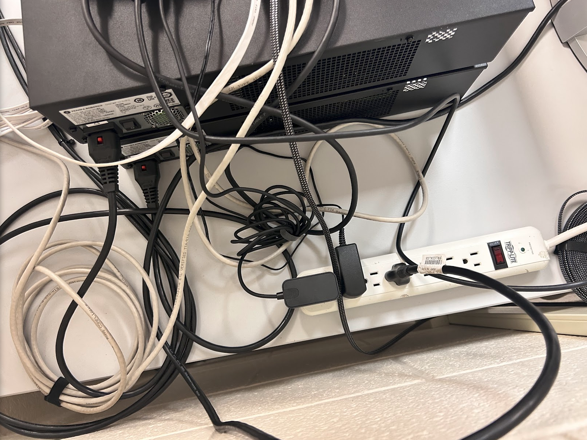

# Basic Franka Connection

This runbook covers the basic steps for powering on the Franka arms, logging in
to the Beelink NUC, opening Franka Desk, and preparing the arms for FCI-based
control.

Use this before running demos such as leader-follower teleoperation.

## Before You Start

Confirm the robot area is safe:

- The workspaces around both arms are clear.
- No one is leaning on or reaching through the robot workspace.
- The emergency stop is reachable.
- The arms, controllers, Beelink NUC, monitor, keyboard, and mouse are
  connected as expected.
- You have the Beelink login credentials and Franka Desk credentials from the
  lab.

## 1. Power On The Arms And Control Computer

Use the power switches shown below to power on the Franka controllers and the
controlling device.



Power-on checklist:

1. Turn on the power strip or outlet supplying the setup.
2. Turn on each Franka controller using its rear power switch.
3. Turn on the Beelink NUC (red button on the front)
4. Wait for the controllers and computer to finish booting.

The Franka arms may take a few minutes before they are ready for Desk. Do not
try to move the arms while they are booting (white flashing lights).

## 2. Log In To The Beelink NUC

The Beelink should be configured to log in at startup. If not, at the monitor connected to the Beelink NUC:

1. Wake the display if it is asleep.
2. Select the lab user account.
3. Enter the Beelink password.
4. Open a browser if it is not already open.

If the Beelink does not show a login screen, confirm that the NUC and monitor
are powered on and that the monitor input is set correctly.

## 3. Connect To Franka Desk

Franka Desk is the browser interface for the arm. Use it to check robot status,
unlock joints, and activate FCI.

1. Open firefox on the Beelink NUC.
2. Enter the Franka Desk address for the arm you are preparing into the search bar.

i.e. 192.168.1.11/desk (this will work even if the Beelink is not connected to a wifi network)

3. Log in with the lab Franka Desk credentials (if neccessary. Should already be logged in).
4. Confirm that Desk shows the correct robot and that its status is healthy.

If you are preparing two arms, repeat this for each arm. Use the Desk address
assigned to each robot, and be careful not to confuse the leader and follower
arms.

## 4. Wait For Blue Arm Lights

After the robot finishes booting and Desk is connected, wait until the Franka
arm lights turn blue.

Blue lights indicate the arm is ready for the next preparation steps. If the
lights remain a different color, check Desk for warnings or errors before
continuing.

Do not unlock joints or activate FCI until the robot is fully ready.

## 5. Unlock Joints

In Franka Desk:

1. Review the robot status and confirm there are no active faults.
2. Make sure the workspace is still clear.
3. Use the Desk control to unlock the robot joints.
4. Watch the robot and be ready to use the emergency stop if anything looks
   unsafe.

After unlocking, the arm may become easier to move or may transition into a
ready state for external control. Keep hands and objects clear unless the demo
procedure explicitly requires interaction.

## 6. Activate FCI

FCI, the Franka Control Interface, must be active before ROS-based control
stacks can command the robot.

In Franka Desk:

1. Confirm the joints are unlocked.
2. Confirm the robot is healthy and ready.
3. Activate FCI for the arm.
4. Leave Desk open so you can monitor robot status during the demo.

If you are running a two-arm demo, activate FCI on both arms before starting
the ROS launch commands. Both arms should now display solid greens lights at the base.

## Ready For ROS Control

After both arms are powered, logged into Desk, showing green lights, unlocked,
and in FCI mode, continue with the demo-specific runbook.

For leader-follower teleoperation, see:

```text
demos/LEADER_FOLLOWER_TELEOP.md
```

## Troubleshooting

### The Beelink NUC Does Not Turn On

Check the power strip, the NUC power cable, and the monitor input. Use the
power-switch image above to confirm the setup is powered as expected.

### Franka Desk Does Not Load

Confirm the Beelink is on the robot network and that you are using the correct
Desk address for the arm. If the page still does not load, check robot power
and network cabling.

### Arm Lights Do Not Turn Blue

Wait a few minutes after power-on. If the lights still do not turn blue, check
Desk for faults, warnings, or boot status. Do not proceed to unlocking joints
or activating FCI until the issue is resolved.

### Joints Will Not Unlock

Check Desk for active faults, confirm the emergency stop is released, and make
sure the robot is in a state where unlocking is allowed.

### FCI Will Not Activate

Confirm the joints are unlocked, the robot is healthy, and no other control
session is active. If Desk reports an error, resolve that error before starting
ROS control.
